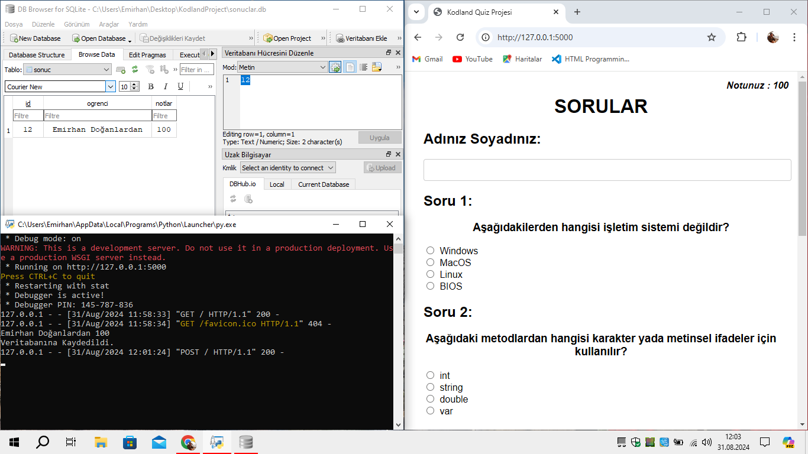

<h2 align="center" >Bu projeyi; python diliyle, Flask API kullanılarak hazırlandım. Proje basit bir Quiz uygulamasıdır. öğrenci adını ve soyadını yazıp, sınava başlıyor. Sınavı bitirdiğinde veritabanına kaydedip. sağ üst köşede aldığı puanı gösteriyor.</h2>
<h3 align="left" >Projenin Görüntüsü :</h3>

  

